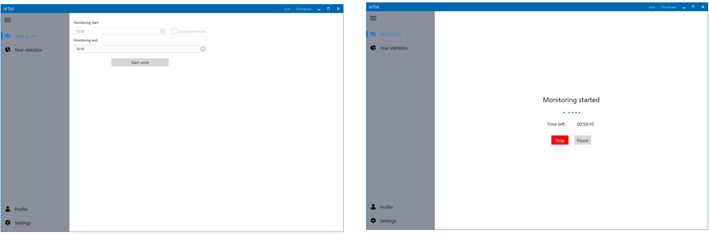
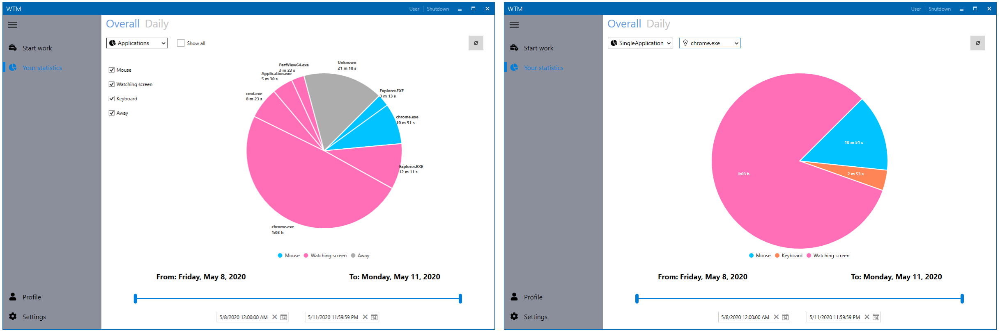
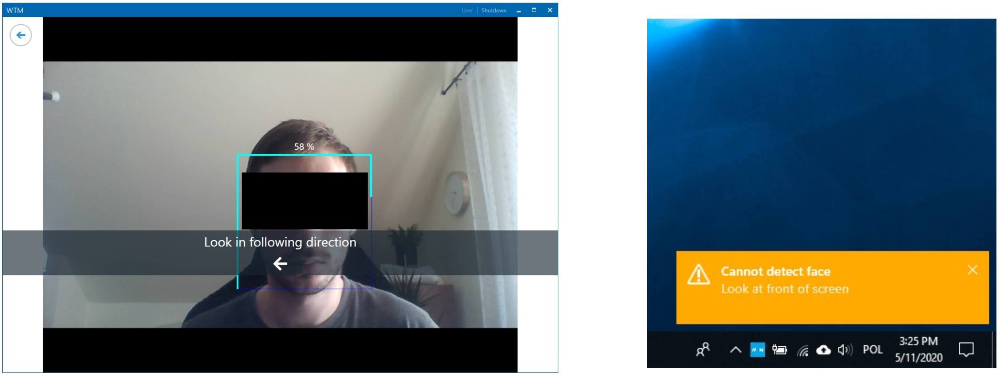

# WTM - Work Time Monitoring

Desktop application that provides capability to monitor work time of an user. It monitors time spent on mouse or keyboard usage with respect to opened application. It uses also face detection and recognition (dlib / haar cascade) to detect when user was not working. \
Monitoring algorithm is implemented as state machine using my library (https://github.com/pekalam/StateMachineLib).
## Frameworks / libraries:
- WPF
- Prism
- OpenCvSharp
- MouseKeyHook
- System.Reactive
- FaceRecognitionDotNet
- StateMachineLib (my project: https://github.com/pekalam/StateMachineLib)

## Screenshots

